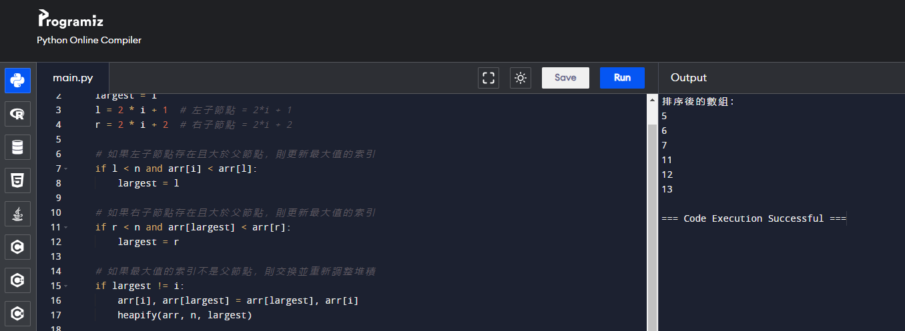

# GenAI_Algorithm_lab1 ==>heap sort的各種實作(heap sort)
- `提問詞`:請寫出heap sort的演算法
- `提問詞`:請計算heap sort演算法的時間複雜度
- `提問詞`:請用Python寫出heap sort的演算法
- `提問詞`:請用C寫出heap sort的演算法
- `提問詞`:請用C++寫出heap sort的演算法
- `提問詞`:請用JAVA寫出heap sort的演算法
- `提問詞`:請用Rust寫出heap sort的演算法
- `提問詞`:請用go寫出heap sort的演算法
- `提問詞`:請用C#寫出heap sort的演算法
- `提問詞`:請用Javascript寫出heap sort的演算法


### 提問詞`:請寫出heap sort的演算法
```
以下是堆積排序的基本步驟：

建立最大堆積（Max Heap）或最小堆積（Min Heap）：
如果要遞增排序，則建立最大堆積，其中父節點的值大於子節點。
如果要遞減排序，則建立最小堆積，其中父節點的值小於子節點。
排序過程：
將根節點（最大值或最小值）與最後一個節點交換。
移除最後一個節點（已排序的部分）。
重新調整堆積，使其滿足堆積性質。
重複以上步驟，直到所有節點都被排序。
堆積排序的時間複雜度為O(nlogn)，其中n是要排序的元素數量。1234

如果你想了解更詳細的實作細節，請參考相關資源。1234
```

### `提問詞`:請用Python寫出heap sort的演算法
```python
def heapify(arr, n, i):
    largest = i
    l = 2 * i + 1  # 左子節點 = 2*i + 1
    r = 2 * i + 2  # 右子節點 = 2*i + 2

    # 如果左子節點存在且大於父節點，則更新最大值的索引
    if l < n and arr[i] < arr[l]:
        largest = l

    # 如果右子節點存在且大於父節點，則更新最大值的索引
    if r < n and arr[largest] < arr[r]:
        largest = r

    # 如果最大值的索引不是父節點，則交換並重新調整堆積
    if largest != i:
        arr[i], arr[largest] = arr[largest], arr[i]
        heapify(arr, n, largest)

def heapSort(arr):
    n = len(arr)

    # 建立最大堆積
    for i in range(n // 2, -1, -1):
        heapify(arr, n, i)

    # 逐一提取元素並重新調整堆積
    for i in range(n - 1, 0, -1):
        arr[i], arr[0] = arr[0], arr[i]  # 交換根節點和最後一個節點
        heapify(arr, i, 0)

# 範例使用的數組
arr = [12, 11, 13, 5, 6, 7]
heapSort(arr)

print("排序後的數組：")
for i in range(len(arr)):
    print(arr[i])
```
- Online Python Interpreter
  - [Online Python Compiler (Interpreter) - Programiz](https://www.programiz.com/python-programming/online-compiler/)


